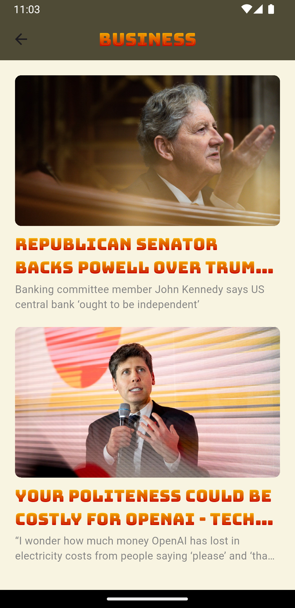

## 📱 NewsApp

A modern, feature-rich news application built with **Flutter** that delivers categorized news content through a clean and responsive interface.

---

## ✨ Features

- **Categorized News**: Browse articles in categories like **Science**, **Health**, **Entertainment**, **Technology**, and **Business**
- **Custom UI**: Sleek design with gradient headers and smooth scrolling
- **Article Previews**: High-quality thumbnails and smartly truncated headlines
- **Detailed Views**: Tap any article to explore the full content
- **Responsive Layout**: Works flawlessly across devices and orientations
- **Secure API Access**: Environment-based API key handling via `flutter_dotenv`

---

## 🖼️ Screenshots
<table>
  <tr>
    <td></td>
    <td></td>
    <td></td>
  </tr>
  <tr>
    <td></td>
    <td></td>
    <td></td>
  </tr>
</table>
---

## 🛠️ Technologies Used

- **Flutter** – Cross-platform UI toolkit
- **Dart** – Programming language optimized for UI
- **Dio** – HTTP client for powerful API handling
- **flutter_dotenv** – Secure API key management
- **CustomScrollView** – Advanced scrolling
- **Custom Fonts** – BungeeSpice, Pacifico, PoetsenOne

---

## 📁 Project Structure

```
news_app/
├── lib/
│   ├── main.dart
│   ├── pages/
│   │   ├── home_page.dart
│   │   ├── category_view.dart
│   │   └── ...
│   ├── models/
│   │   ├── article.dart
│   │   └── ...
│   ├── services/
│   │   ├── api_service.dart
│   │   └── news_service.dart
│   ├── widgets/
│   │   ├── category_card.dart
│   │   ├── category_list_view.dart
│   │   ├── news_list_view.dart
│   │   ├── news_list_view_builder.dart
│   │   ├── news_tile.dart
│   │   └── ...
├── assets/
│   └── ...
├── fonts/
│   ├── BungeeSpice-Regular.ttf
│   ├── Pacifico-Regular.ttf
│   └── PoetsenOne-Regular.ttf
├── .env
├── pubspec.yaml
└── README.md
```

---

## 🚀 Getting Started

### ✅ Prerequisites

- Flutter SDK
- Dart SDK
- A news API key (e.g. from [NewsAPI.org](https://newsapi.org))

### 🔧 Installation

```bash
# 1. Clone the repository:
git clone https://github.com/yourusername/news_app.git

# 2. Navigate into the project:
cd news_app

# 3. Create a .env file in the root directory with your API key:
echo API_KEY=your_api_key_here > .env

# 4. Install dependencies:
flutter pub get

# 5. Run the app:
flutter run
```

---

## ⚙️ Configuration

The `.env` file is essential and must contain:

```env
API_KEY=your_actual_api_key
```

Make sure it's declared as an asset in your `pubspec.yaml`:

```yaml
flutter:
  assets:
    - .env
```

---

## 🌐 API Integration

This app uses a third-party news API to fetch categorized articles. All integration is managed in:

- `lib/services/api_service.dart`
- `lib/services/news_service.dart`

It includes:

- URL building
- API key usage
- Error handling
- Response parsing

---

## 🎨 Styling Highlights

- Gradient headers with warm tones (orange/red)
- Consistent padding and spacing
- Card-style article layout
- Rich custom fonts for a modern reading experience

---

## 🔮 Future Features

- User authentication with personalized news feed
- Favorite article bookmarking
- Full dark mode support
- Push notifications
- Offline reading capabilities

---

## 🤝 Contributing

Pull requests are welcome! Feel free to fork the repo and submit your improvements or ideas.

---

## 📄 License

This project is licensed under the **MIT License** – see the [LICENSE](LICENSE) file for details.

---

## 🙌 Acknowledgements

- [News API](https://newsapi.org/) for the content
- Flutter team for the powerful UI toolkit
- Open-source community for tools, packages, and inspiration

---

> Made with ❤️ by [إYoussefShawky0]
